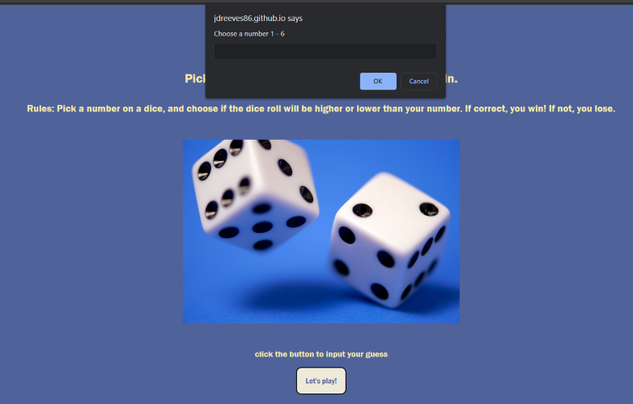

# Dice Game #

## Contents ##

---

1. About
2. Screenshots
3. Links

---

 
 

### About ###

---

Ever played High-Low with dice before? Ever lost money playing dice? Enjoy this rudimentary take on High-Low, where the stakes are low, and the quality of my CSS is lower. 

Upon starting the game you will be prompted to pick a number 1-6. Once you have made your choice, you will choose if the dice roll is higher or lower than your guess. If correct, you win! If not, you lose. What do you win? Nothing. What do you lose? 10 seconds of your time. Why spend time with your *family* or *friends* doing *things you love*? When you could be playing this game over and over and over and over...

Despite what you may feel about the simple nature of this game, my daughter loves playing it. Her opinion means a lot to me. This was developed as a way to practice some of the JS concepts I learned while preparing myself for more formal training and education in web development. It's not the prettiest, but it works and that was my goal.

---

 
 

### Screenshots ###

---

 

---

 

I have the worst luck.

 

---

 

We're not playing D&D... no 20 sided dice here.

---

 
 

### Links ###

---

 

GitHub repositories: https://github.com/JDReeves86?tab=repositories

Portfolio: https://jdreeves86.github.io/02challengeTurnIn/

Dice Game live page: https://jdreeves86.github.io/diceGame/

LinkedIn: https://www.linkedin.com/in/jacob-reeves-4237a9238/